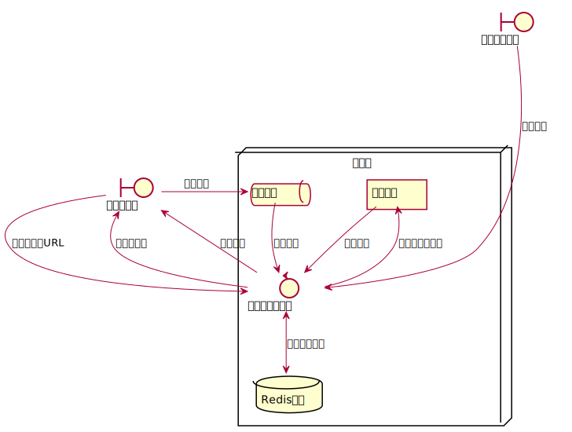

# 众衡

本系统是为ThinkSpirit实验室的下一代在线评测系统设计的评测机系统。专职负责运行用户程序并得出判定结论。

本系统的创新之处在于剥离了前代评测机中对系统其他部分使用的 `redis` 服务的直接依赖，改用 `WebSocket` 作为通信方式。可以穿过多层代理进行通信。

同时采用 控制/从机 架构，使得在需要的时候可以快速向评测系统中添加算力，以应对例如大规模重测一类的突发需求。

系统由评测控制端和评测机组成。系统内部的通信由[内部协议](./InternalProtocolSummary.md)定义。系统与客户系统如在线评测系统的通信由[外部协议](./ExternalProtocolSummary.md)定义。

## 开发背景

经过将近十年的开发，我校在线评测系统已经初具规模。现有的评测内核已经比较稳定，支持多种编程语言和SPJ。基本上满足需求。

但是随着比赛规模，题库体量的增加，早期的评测架构开始出现力不从心的迹象。

由于需要直接访问网页后端使用的redis服务，导致难以穿过学校网关进行部署，难以引入灵活的多评测机机制。结果是在评测任务重时会抢占网站后端资源，导致网站陷入不能访问的局面。也难以拓展更高的评测性能。

在一次比赛中由于题目数据修改而进行重测的过程中，就出现了由于抢占资源导致的失去响应异常。

因此决心开发支持穿过http代理部署的且支持灵活增减评测机的评测系统。

## 开发计划

### 多评测机支持

采用 `C/S` 架构， `ws` 协议实现单控多评测机。

### 与网页后端的redis隔离

与在线评测系统等客户系统之间使用 http 或 `WebSocket` 进行通信。通过 http 下载题目有关文件。

支持同时连接多个客户系统，并对客户系统进行基于身份的权限控制。

保持架构的相对独立，使用独立的redis服务，方便分离部署以及架设相关代理。

### 语言无关性

在设计中不使用与特定语言绑定的功能如 `socket.io` 。方便有兴趣的同学用自己喜好的语言编写自己的实现。

## 架构

本端以图片为主，描述了系统的总体架构

### 系统组成

系统主要由一个评测控制端和多个评测机组成。

所有的评测机是等价的。运算速度的区别通过基线测试来计算修正系数。

### 系统外部

系统可以服务于多个需要进行在线评测的外部系统

同时可以向具有观察员权限的系统或用户提供系统运行状态

### 架构图

#### 数据流图

##### 系统

##### 评测机

## 协议组成
